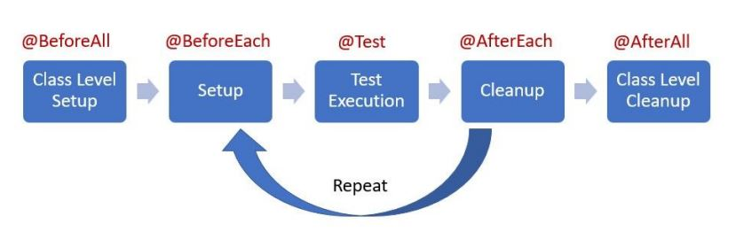

# Урок 2. Знакомство с тестовыми фреймворками

## Classwork

### task001(simple_shopping_cart):

Задание №0
Обзор кода проекта
Введение в юнит-тестирование
Проект представляет собой простую модель онлайн-магазина, в котором имеются следующие основные компоненты:

1. Product: Класс, представляющий продукт. У каждого продукта есть идентификатор, название, цена и
   количество.
2. Shop: Класс, представляющий магазин. У каждого магазина есть список продуктов, которые он предлагает.
3. Cart: Класс, представляющий корзину покупателя. В корзину можно добавлять и удалять товары, а также
   рассчитывать общую стоимость товаров в корзине.
4. TextUserInterface: Класс, представляющий текстовый пользовательский интерфейс, который предлагает
   пользователю варианты действий, такие как просмотр продуктов магазина, добавление и удаление товаров из
   корзины.
   Важными методами являются addProductToCartByID и removeProductByID, которые добавляют и удаляют продукт из
   корзины соответственно. Вся логика по обновлению количества товаров в магазине и корзине, а также пересчете
   общей стоимости товаров, инкапсулирована в этих методах.
   Задание №1
   Разработайте модульный тест для проверки, что общая стоимость корзины с разными
   товарами корректно рассчитывается
   Введение в юнит-тестирование
   Ожидаемый результат: Стоимость корзины посчиталась корректно

Задание №2
Создайте модульный тест для проверки, что общая стоимость корзины с множественными
экземплярами одного и того же продукта корректно рассчитывается.
? Ожидаемый результат: Стоимость корзины посчиталась корректно

Задание №3
Напишите модульный тест для проверки, что при удалении товара из
корзины происходит перерасчет общей стоимости корзины.
? Ожидаемый результат: Вызывается метод пересчета стоимости
корзины, стоимость корзины меняется

Задание №4
Разработайте модульный тест для проверки, что при добавлении определенного количества
товара в корзину, общее количество этого товара в магазине соответствующим образом
уменьшается.
? Ожидаемый результат: Количество товара в магазине
уменьшается на число продуктов в корзине пользователя

Задание №5
Создайте модульный тест для проверки, что если пользователь забирает все имеющиеся
продукты определенного типа из магазина, эти продукты больше не доступны для заказа.
Введение в юнит-тестирование
Ожидаемый результат: Больше такой продукт
заказать нельзя, он не появляется на полке

Задание №6
Напишите модульный тест для проверки, что при удалении товара из корзины, общее
количество этого товара в магазине соответствующим образом увеличивается.
Введение в юнит-тестирование
Ожидаемый результат: Количество продуктов этого типа на складе
увеличивается на число удаленных из корзины продуктов

Задание №7
Разработайте параметризованный модульный тест для проверки, что при вводе неверного
идентификатора товара генерируется исключение RuntimeException.
*Сделать тест параметризованным
Введение в юнит-тестирование
Ожидаемый результат: Исключение типа RuntimeException и сообщение
Не найден продукт с id 

Задание №8
Создайте модульный тест для проверки, что при попытке удалить из корзины больше
товаров, чем там есть, генерируется исключение RuntimeException.
Введение в юнит-тестирование
Ожидаемый результат: Исключение типа RuntimeException и сообщение
В корзине не найден продукт с id

Задание №9
Восстановите и оптимизируйте данный тестовый метод
Введение в юнит-тестирование
// boolean Сломанный-Тест() {
// // Assert (Проверка утверждения)
//
assertThat(cart.getTotalPrice()).isEqualTo(cart.getTotalPrice());
// // Act (Выполнение)
// cart.addProductToCartByID(2); // 250
// cart.addProductToCartByID(2); // 250
// // Arrange (Подготовка)
// Shop shop = new Shop(getStoreItems());
// Cart cart = new Cart(shop);
// }

Задание №10
Нужно оптимизировать тестовый метод, согласно следующим условиям:
1. Отображаемое имя - "Advanced test for calculating TotalPrice"
2. Тест должен повторяться 10 раз
3. Установлен таймаут на выполнение теста 70 Миллисекунд (unit = TimeUnit.MILLISECONDS)
4. После проверки работоспособности теста, его нужно выключить

Задание №11
Введение в юнит-тестирование
Предложите способ оптимизировать тестовый класс

## Homework:
*Задание 1.
Проект Vehicle. Написать следующие тесты с использованием JUnit5:

- Проверить, что экземпляр объекта Car также является экземпляром транспортного средства (используя оператор instanceof).

- Проверить, что объект Car создается с 4-мя колесами.

- Проверить, что объект Motorcycle создается с 2-мя колесами.

- Проверить, что объект Car развивает скорость 60 в режиме тестового вождения (используя метод testDrive()).

- Проверить, что объект Motorcycle развивает скорость 75 в режиме тестового вождения (используя метод testDrive()).

- Проверить, что в режиме парковки (сначала testDrive, потом park, т.е. эмуляция движения транспорта) машина 
останавливается (speed = 0).

- Проверить, что в режиме парковки (сначала testDrive, потом park, т.е. эмуляция движения транспорта) мотоцикл 
останавливается (speed = 0).

В этом проекте, вы будете работать с проектом ""Vehicle"", который представляет собой иерархию классов, включающую 
абстрактный базовый класс ""Vehicle"" и два его подкласса ""Car"" и ""Motorcycle"".

Базовый класс ""Vehicle"" содержит абстрактные методы ""testDrive()"" и ""park()"", а также поля ""company"", ""model"", 
""yearRelease"", ""numWheels"" и ""speed"".

Класс ""Car"" расширяет ""Vehicle"" и реализует его абстрактные методы. При создании объекта ""Car"", число колес 
устанавливается в 4, а скорость в 0. В методе ""testDrive()"" скорость устанавливается на 60, а в методе ""park()"" - 
обратно в 0.

Класс ""Motorcycle"" также расширяет ""Vehicle"" и реализует его абстрактные методы. При создании объекта ""Motorcycle"", 
число колес устанавливается в 2, а скорость в 0. В методе ""testDrive()"" скорость устанавливается на 75, а в методе 
""park()"" - обратно в 0.